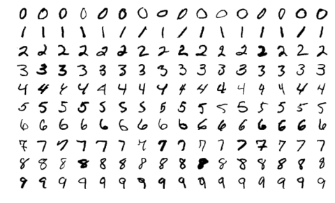

# Handwritten Digit Recognition
In this iPython Noetbook we are going to use the MNIST dataset for the implementation of a handwritten digit recognition app using LogisticRegression and SGDClassifier and comapre the accuracy and other metrics.  
You can follow the analysis on <a href="https://www.kaggle.com/code/shrikrishnaparab/handwritten-digit-recognition">kaggle</a> 

## Packeges Used:
![Python][python] ![Jupyter Notebook][ipython-image]  

[python]: https://img.shields.io/badge/python-3670A0?style=for-the-badge&logo=python&logoColor=ffdd54
[ipython-image]: https://img.shields.io/badge/jupyter-%23FA0F00.svg?style=for-the-badge&logo=jupyter&logoColor=white

## Introduction 
Handwritten digit recognition is the process to provide the ability to machines to recognize human handwritten digits. It is not an easy task for the machine because handwritten digits are not perfect, vary from person-to-person, and can be made with many different flavors.

## About Dataset:
The MNIST dataset is a dataset of handwritten digits, which has 60,000 training samples and 10,000 test samples. Each image is 28x28 pixels and is labeled with the corresponding digit. It is widely used as a benchmark for image classification and machine learning algorithms, and is often used as the "Hello World" of machine learning.

## ML Algorith Used:  
        - LogisticRegression  
        - SGDClassifier

## Conclusion:
### LogisticRegression:
The accuracy we get is 97.81 with Precision of 91.24, Recall of 86.23 and f1_score of 88.67.
### SGDClassifier:
The accuracy we get is 95.97 with Precision of 90.66, Recall of 74.84 and f1_score of 81.99.
So if we compare both the  above algorithms we can see that the logistic Regression works better. 

## Future Tasks:
Try other ML and Deep Learning Algorithms and evaluate the results. 
